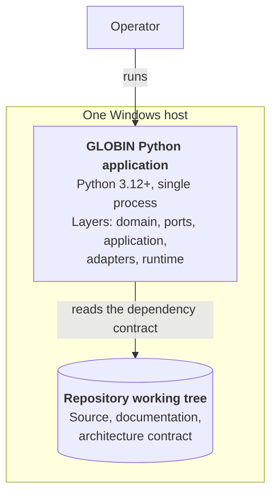

# Containers

The C4 Container view: one level inside the box drawn in
[`SYSTEM_CONTEXT.md`](SYSTEM_CONTEXT.md).

> **"Container" here does not mean Docker.** In the C4 model a container is an
> application or a data store — something that must be *running*, or must
> *exist*, for the system to work. A server-side application, a desktop
> application, a database schema, a blob store, a file system and a shell script
> are all containers. GLOBIN uses no Docker, no orchestrator and no
> containerisation of any kind
> ([ADR-0013](../adr/0013-modular-monolith-as-the-initial-architecture.md)).

---

## What exists today

One container. GLOBIN is a modular monolith, so the running system is a single
Python process, and the repository is the only store that currently holds
anything.

| Container | Technology | Responsibility |
|---|---|---|
| GLOBIN Python application | Python 3.12 or later, single process, no runtime dependencies | Holds all production code, organised into the five layers |
| Repository working tree | Files on the operator's disk | Source, documentation, and the machine-readable architecture contract that the application reads |

The second entry is a container in the C4 sense — a file system the application
genuinely reads — and it is listed because omitting it would misrepresent the
one real data flow that exists. The architecture review reads
[`dependency-rules.toml`](dependency-rules.toml) from the working tree, which is
why it takes a repository path rather than guessing one.

That is the complete inventory. There is no database, no data lake, no model
registry, no scheduler and no bot process, because no phase has built one.

---

## Containers the programme will add

None of the following exists. Each is listed with the phase that will build it,
so this document can be extended rather than rewritten, and so no reader mistakes
a plan for a capability.

| Planned container | Will hold | Owning phases |
|---|---|---|
| Local persistent data store | Market data, instrument registry, point-in-time datasets | 097-112 |
| Model and artefact store | Trained models, feature pipelines, run metadata | 177-208 |
| Backtest and research results store | Results with the configuration and data lineage that produced them | 145-176 |
| Telegram bot interface | Operator commands, status and alerts | 273-288 |
| Orchestrator process | Supervision of long-running subsystems | 257-272 |
| Windows launchers | The operator's entry points | 289-304 |

Two of these are decisions rather than certainties. Whether the orchestrator is
a separate process or a thread inside the single application is a concurrency
question Phase 261 owns; ADR-0013 chose the deployment topology, not the
process model. Which storage engines and formats are used is Phase 097's
decision, taken against the zero-budget and local-host constraints.

---

## Why the application stays one container

The full argument is in
[ADR-0013](../adr/0013-modular-monolith-as-the-initial-architecture.md). In
short: independent deployment needs a pipeline, independent scaling needs a
second host, team autonomy needs a second contributor, and fault isolation
between components that move money is more dangerous than it sounds. GLOBIN has
one host, one operator and no pipeline.

Splitting a component out later is not blocked by this. The seam is the **port**
it is reached through, so a process boundary means writing a new adapter, not
restructuring the core.

---

## How the layers relate to the container

The five layers described in [`README.md`](README.md) are *not* containers. They
are the internal structure of the single application container — the C4
component level, one further zoom in. They are documented in prose and enforced
by [`dependency-rules.toml`](dependency-rules.toml) rather than drawn here,
because a component diagram that merely restates the dependency matrix would be
a second copy of it, and the copy would eventually be the stale one.
