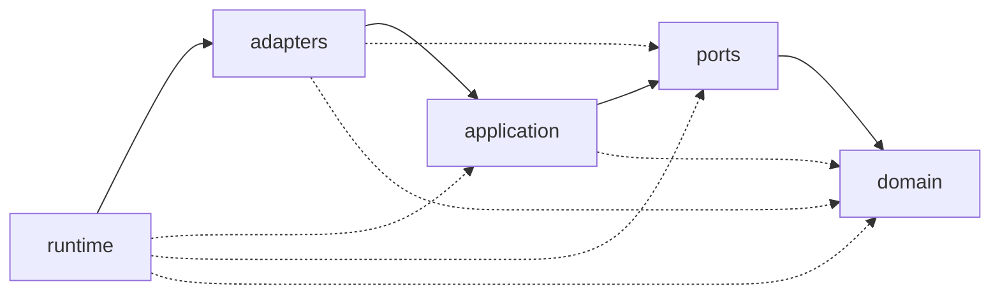

# Architecture

How GLOBIN is put together, and which rules about its shape are binding.

These documents describe *structure*. Durable technical reasoning that is not
structural lives in [`../ARCHITECTURE_PRINCIPLES.md`](../ARCHITECTURE_PRINCIPLES.md);
individual decisions live in [`../adr/`](../adr/README.md); rules about how work
is carried out live in [`../engineering/`](../engineering/ENGINEERING_CONTRACT.md).

---

## What owns what

Each fact below has exactly one home. Nothing here restates a rule that another
file owns, because a restated rule eventually disagrees with itself and nothing
says which copy is wrong.

| Artefact | Owns | Update it when |
|---|---|---|
| [`dependency-rules.toml`](dependency-rules.toml) | The dependency matrix: layers, permitted directions, I/O permission | A layer is added, or a permitted direction changes |
| [`SYSTEM_CONTEXT.md`](SYSTEM_CONTEXT.md) | The system boundary, the actors, the external systems | GLOBIN starts or stops interacting with something outside itself |
| [`CONTAINER.md`](CONTAINER.md) | The runnable and storable parts of GLOBIN | A new process or data store becomes real |
| This file | Layer responsibilities, and the rules that hold across all of them | A structural rule is added or changed |
| [`../adr/`](../adr/README.md) | Why any of it was decided | A decision is made, changed or reversed |

The matrix is **machine-readable and canonical**. Prose here explains it; tests
read it. If this document and the TOML file ever disagree, the TOML file is
right and this document is a defect —
[`../engineering/SOURCE_OF_TRUTH.md`](../engineering/SOURCE_OF_TRUTH.md).

---

## The layers

GLOBIN is a modular monolith ([ADR-0013](../adr/0013-modular-monolith-as-the-initial-architecture.md)):
one repository, one Python distribution, one process, with boundaries enforced
at package level rather than across a network.

Inside that package there are five layers, and they are ordered.

| Layer | Package | Responsibility |
|---|---|---|
| Domain | `globin.domain` | Pure concepts, values and rules. Knows nothing outside itself. |
| Ports | `globin.ports` | Abstract contracts describing what the core needs from the world. |
| Application | `globin.application` | Use cases coordinating domain objects through ports. |
| Adapters | `globin.adapters` | Concrete implementations of ports. The only layer that touches the world. |
| Runtime | `globin.runtime` | The composition root. Builds objects and wires dependencies. |

A useful test when placing a new module: **describe what it does without naming
a technology.** If the description survives, it belongs inward. If it needs the
words "HTTP", "Binance", "file" or "Windows" to make sense, it belongs in
`adapters`.

Two modules sit above the stack rather than inside it.
[`project_contract.py`](../../src/globin/project_contract.py) and
[`roadmap.py`](../../src/globin/roadmap.py) hold identity and programme policy
as constants. Any layer may read them; they may import no layer, and a test
enforces that the relationship stays one-way.

---

## Dependencies point inward

Solid arrows show the primary path; dotted arrows show the other permitted
inward dependencies. There are no arrows in the other direction, and that
absence is the whole contract.

Stated as rules:

- `domain` imports no layer at all.
- `ports` may import `domain`. It must not know who implements it.
- `application` may import `domain` and `ports`. It must not name a concrete
  adapter.
- `adapters` may import `domain`, `ports` and `application`.
- `runtime` may import everything, and nothing may import `runtime`.
- No import cycle is permitted anywhere in the package.

An import written inside `if TYPE_CHECKING:` counts exactly as much as one at
the top of the file. A module that needs a type from another layer is coupled to
it whether or not the import survives to runtime, and treating those as
invisible would leave a documented way to hide a violation.

The reasoning is in [ADR-0014](../adr/0014-layered-ports-and-adapters-and-inward-dependencies.md).
The enforcement is
[`tests/architecture/test_architecture_contract.py`](../../tests/architecture/test_architecture_contract.py),
which reads the TOML and checks the real import graph against it.

---

## The inner layers perform no I/O

`domain`, `ports` and `application` must be runnable without a network, a
filesystem, an environment, a clock or a credential. The observable form of that
rule is the import list: reaching for `os`, `pathlib`, `socket`, `urllib`,
`subprocess`, `logging` or `threading` from an inner layer is a test failure.

This is a proxy, not a proof. A domain function handed an already-open file
object performs I/O while importing nothing suspicious. What the check catches
is the way the boundary is realistically crossed — someone reaches for `pathlib`
because it was convenient — and a green build should be read as "the obvious
route was not taken", never as "the core is provably pure".

---

## Importing performs no work

Importing any layer module must not open a connection, read or write a file,
read a credential, validate an environment, start a subprocess, thread or
scheduler, initialise a GPU, load a model, construct a client, or install a
logging handler.

`import globin` must behave identically on a machine with no credentials, no
network and no data directory. The rule and its enforcement are recorded in
[ADR-0015](../adr/0015-single-composition-root-and-no-import-time-side-effects.md).

---

## One composition root

`globin.runtime` is the only place a concrete adapter is constructed. Everywhere
else, an implementation arrives as a constructor argument typed as a port.

GLOBIN uses **no dependency injection framework**. Composition is a plain
function that builds objects and returns them: typed, traceable in a stack
trace, and readable top to bottom. See
[`composition.py`](../../src/globin/runtime/composition.py) for the worked
example.

---

## Secrets stay outside the core

No credential handling exists yet — Phase 015 designs it, and Phase 017 onwards
builds the environment around it. The structural boundary is nonetheless fixed
now, because it constrains what the intervening phases may build:

- `domain` and `application` hold no API key, secret or token, and have no type
  that represents one.
- Retrieving a secret is an adapter responsibility, selected by `runtime`.
- A secret value is never passed into an inner layer in raw form. What crosses
  the boundary is an authenticated capability, not the credential behind it.
- No credential is read at import time, under any circumstances.

---

## What this phase did not decide

Stated so that a later phase does not assume the question was settled here.

- **Threading, process supervision and isolation** between long-running
  subsystems — Phase 261. Choosing a monolith is a topology decision, not a
  concurrency model.
- **The exception hierarchy** — Phase 005. Malformed input in the code written
  here raises `ValueError`, deliberately rather than a bespoke type, so that no
  competing scheme exists for Phase 005 to unpick.
- **Structured logging** — Phase 006. No layer configures logging.
- **The configuration model** — Phase 007.
- **Naming, docstring and typing conventions, and the lint and type
  configuration** — Phase 013, by
  [ADR-0012](../adr/0012-phase-003-delivers-architecture-boundaries.md).
- **Any Binance capability whatsoever.** No client, endpoint, transport,
  credential or product adapter exists. See [`../../ROADMAP.md`](../../ROADMAP.md).
