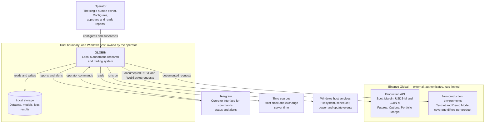

# System Context

The C4 System Context view: GLOBIN as a single box, the people who use it, and
the external systems it depends on. Detail is deliberately absent — this is the
zoomed-out picture, and its job is to make the **boundary** obvious.

Everything outside the GLOBIN box is something GLOBIN does not own, cannot fix,
and must therefore treat as capable of being slow, wrong or absent.

---

## The view

Solid arrows point from the initiator of an interaction to its target. Boxes
inside the dashed trust boundary run on hardware the operator controls;
everything else is reached across a network the operator does not.

---

## The actors and systems

### Operator

One person: the owner of the machine, the Binance account and the capital.
There are no roles, no permissions model and no second user. The operator
configures the system, approves what the governance rules require to be
approved, and reads what it reports.

This is why GLOBIN has no authentication of its own, and why
[ADR-0009](../adr/0009-windows-bat-launchers-as-entry-points.md) can make two
`.bat` files the entire entry surface.

### Binance Global

The only venue in scope ([ADR-0002](../adr/0002-binance-global-only-exchange-scope.md)),
and the only system GLOBIN both depends on and cannot observe directly. Three
properties make it the most consequential box on this diagram:

- **A failed request does not prove a failed operation.** A timeout or a 5XX
  leaves order state *unknown*, and it must be resolved by querying the
  exchange rather than assumed.
- **Rate limits are a correctness concern**, not politeness. Exhausting request
  weight while a position needs closing is a risk event.
- **There is no single test environment.** Testnet and Demo Mode are different
  systems with different coverage per product, which is why they are drawn
  separately above.

All three are argued in
[`../ARCHITECTURE_PRINCIPLES.md`](../ARCHITECTURE_PRINCIPLES.md) and are the
reason exchange access sits behind adapters rather than being called directly.

Access is by **officially documented interfaces only**. Scraping the site,
parsing its pages and calling undocumented endpoints are prohibited without
exception ([ADR-0004](../adr/0004-official-apis-only-no-scraping.md)).

### Telegram

The operator's remote interface: status, alerts and commands when the operator
is not at the machine. It is drawn outside the boundary because messages travel
over a third-party service that can be delayed or unavailable, and because
anything sent there has left the host.

Nothing is built yet; Phases 273-288 own it.

### Local storage

Datasets, trained models, logs and results. Inside the boundary, on the
operator's disk, with no cloud component — a consequence of the zero-budget
runtime rule ([ADR-0003](../adr/0003-zero-budget-open-source-dependency-policy.md))
as much as of privacy.

It appears here as one box because at this zoom level its internal division does
not matter. [`CONTAINER.md`](CONTAINER.md) separates the parts that are real
today from the parts that are planned.

### Time sources

Two of them, and conflating them is a known way to lose money. The host clock
can drift; the exchange's server time is what the venue validates requests
against. GLOBIN must treat them as distinct inputs rather than as one fact.

Phase 009 established the clock discipline for the first of the two: the host
clock is reached only through [`globin.ports.clock`](../../src/globin/ports/clock.py),
and the instants it produces are UTC by construction
([`TIME_POLICY.md`](../TIME_POLICY.md)). The venue's server time is a second and
independent source; reconciling the two, and deciding what to do when they
disagree, is **Phase 040**. Nothing reaches a venue yet.

### Windows host services

The filesystem, the task scheduler, and the power and update events that will
suspend or restart the machine underneath a running system. GLOBIN is a guest
here: it must survive sleep, restart and forced updates rather than assume
continuous operation.

---

## Trust boundaries

There are two, and the distinction drives most of the defensive design.

**Inside the host.** The operator's machine. Data at rest here is under the
operator's control. Failures are local, observable, and usually recoverable by
restarting.

**Outside the host.** Binance and Telegram. Reached over a network, subject to
latency, partition, rate limiting, authentication and unilateral change. Every
crossing of this boundary is an adapter, and every response from across it is
treated as untrusted input.

The rule that follows: **the core never crosses a trust boundary.** `domain`,
`ports` and `application` cannot reach the network at all, so the set of code
that can be wrong about an external system is confined to `adapters` and is
enumerable. The boundary in the diagram and the boundary in the package layout
are the same boundary, described twice.

Credentials belong entirely to the outer side. No secret reaches the inner
layers in raw form, and none is read at import time
([ADR-0015](../adr/0015-single-composition-root-and-no-import-time-side-effects.md)).
Secret storage and redaction are specified in
[`../security/SECURITY_BASELINE.md`](../security/SECURITY_BASELINE.md) and
implemented from Phase 028; the structural rule is fixed now so the intervening
phases cannot build against a different assumption.

---

## What is not shown

No box on this diagram is implemented. GLOBIN does not currently connect to
Binance, hold credentials, send a Telegram message, read a clock for trading
purposes or write a dataset. The view describes the system the programme is
building, and [`../../ROADMAP.md`](../../ROADMAP.md) states what exists today.

Deliberately absent, because they belong to a lower zoom level: the internal
layers (see [`README.md`](README.md)), the per-product API differences (Phase
036 builds the capability matrix), and anything about transports or protocols.
